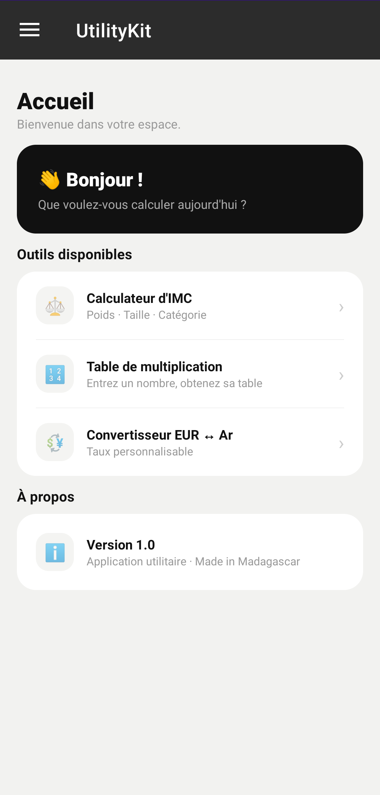
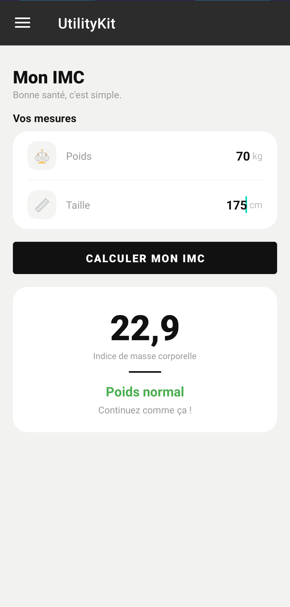
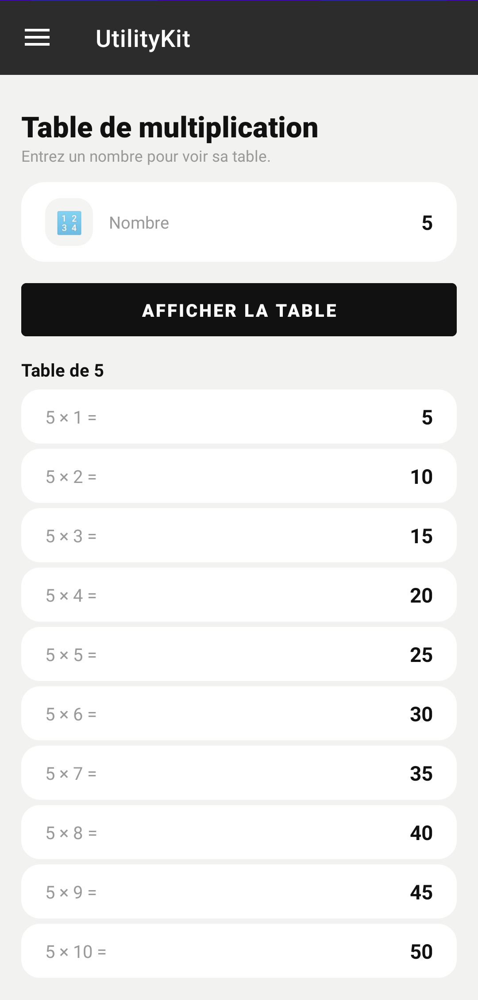
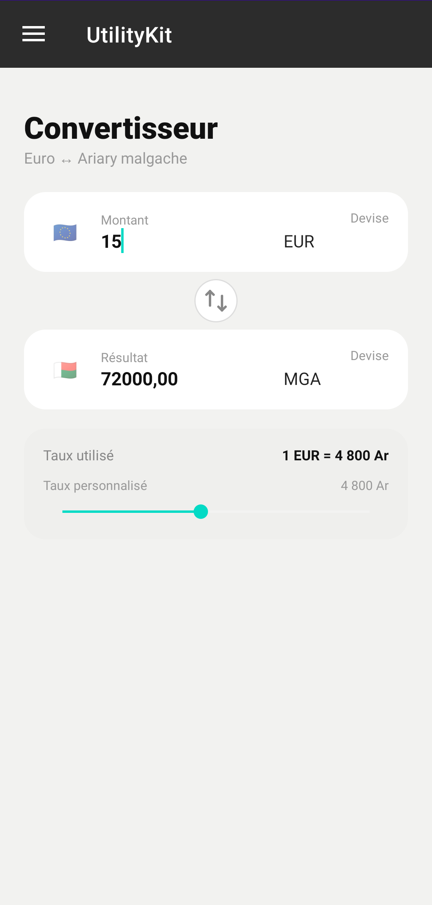

# 📱 UtilityKit — Application Android

> Application Android utilitaire développée en Java, avec une interface soignée et une navigation par tiroir latéral.  
> Projet réalisé dans le cadre du cours de développement mobile.

---

## 📸 Aperçu des écrans

| Écran 1 — Accueil | Écran 2 — Mon IMC | Écran 3 — Multiplication | Écran 4 — Convertisseur |
|:-:|:-:|:-:|:-:|
|  |  |  |  |

---

## ✅ Fonctionnalités

- 🏠 **Accueil** — Tableau de bord avec accès rapide à tous les outils
- ⚖️ **Calculateur d'IMC** — Calcul de l'indice de masse corporelle avec catégorie et conseil personnalisé
- 🔢 **Table de multiplication** — Génération dynamique de la table pour n'importe quel nombre
- 💱 **Convertisseur EUR ↔ Ariary** — Conversion bidirectionnelle avec taux personnalisable via curseur
- 🚪 **Quitter** — Fermeture directe de l'application depuis le menu

---

## 🏗️ Architecture du projet

```
com.example.utilitykit/
│
├── MainActivity.java           # Activité principale — DrawerLayout + Toolbar + navigation
│
├── HomeFragment.java           # Écran 1 — Accueil avec liens vers chaque outil
├── BmiFragment.java            # Écran 2 — Calculateur d'IMC
├── MathFragment.java           # Écran 3 — Table de multiplication
├── MoneyFragment.java          # Écran 4 — Convertisseur EUR ↔ Ariary
│
└── res/
    ├── layout/
    │   ├── activity_main.xml           # DrawerLayout + Toolbar + FrameLayout
    │   ├── fragment_home.xml           # Carte d'accueil + liste des outils
    │   ├── fragment_bmi.xml            # Inputs poids/taille + carte résultat
    │   ├── fragment_math.xml           # Input nombre + RecyclerView résultats
    │   └── fragment_money.xml          # Double carte + SeekBar taux
    └── menu/
        └── drawer_menu.xml             # Menu tiroir avec 5 items
```

### Navigation entre les écrans

```
MainActivity
    │
    ├── Menu tiroir ──► Accueil         (HomeFragment)
    │                ├► Mon IMC         (BmiFragment)
    │                ├► Convertisseur   (ConverterFragment)
    │                ├► Multiplication  (TableFragment)
    │                └► Quitter         finish()
    │
    └── HomeFragment
            ├── Tap "Calculateur d'IMC"     ──► BmiFragment
            ├── Tap "Table de multiplication" ► TableFragment
            └── Tap "Convertisseur EUR ↔ Ar" ► ConverterFragment
```

---

## 📐 Détail des outils

### ⚖️ Calculateur d'IMC

Formule utilisée : **IMC = Poids (kg) ÷ Taille² (m)**

| Valeur IMC | Catégorie | Conseil |
|---|---|---|
| < 18.5 | Insuffisance pondérale | Consultez un médecin |
| 18.5 — 24.9 | Poids normal | Continuez comme ça ! |
| 25.0 — 29.9 | Surpoids | Adoptez une activité physique |
| ≥ 30.0 | Obésité | Consultez un professionnel de santé |

---

### 🔢 Table de multiplication

- L'utilisateur saisit un nombre entier
- L'application génère la table de 1 à 10 via un `RecyclerView`
- Chaque ligne affiche : `N × i = résultat`

---

### 💱 Convertisseur EUR ↔ Ariary

- Conversion **bidirectionnelle** : saisie possible depuis les deux champs
- **Taux par défaut :** `1 EUR = 4 800 Ar`
- **Taux personnalisable** via un `SeekBar` (plage : 3 000 — 5 000 Ar)
- Bouton **swap** (↕) pour inverser les devises instantanément

---

## 🛠️ Technologies utilisées

| Technologie | Usage |
|---|---|
| **Java** | Langage principal |
| **Android SDK** | Framework mobile |
| **Fragment** | Navigation entre les écrans |
| **DrawerLayout** | Menu tiroir latéral |
| **RecyclerView** | Affichage de la table de multiplication |
| **CardView** | Composant carte pour le design |
| **SeekBar** | Curseur pour le taux de change |
| **ActionBarDrawerToggle** | Icône ☰ synchronisée avec le tiroir |

---

## 🚀 Installation

### Prérequis

- **Android Studio Hedgehog | 2023.1.1** ou supérieur
- **Java 11** (fourni avec Android Studio)
- SDK Android **21 minimum** (Android 5.0)

### Étapes

1. **Cloner le dépôt**
   ```bash
   git clone https://github.com/razanakoto-carlos/utility-kit-android.git
   ```

2. **Ouvrir dans Android Studio**
   ```
   File → Open → sélectionner le dossier UtilityKit
   ```

3. **Synchroniser Gradle**
   ```
   File → Sync Project with Gradle Files
   ```

4. **Lancer l'application**
    - Sur émulateur : `Run → Run 'app'`
    - Sur appareil physique : activer le **mode développeur** + **débogage USB**

---

## 👨‍💻 Auteur

**Carlos** — Étudiant en Génie Logiciel  
Projet réalisé avec Android Studio · Java · Fragments

---